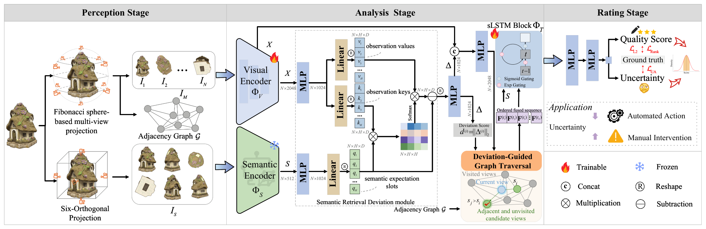

# No-Reference Point Cloud Quality Assessment via Semantic-Prior Guided Multi-View Sequence Modeling and Uncertainty Quantification

## 🧩 Framework



Framework of the proposed PriSeqU-PCQA method, comprising the perception, analysis, and rating stages.

## ⚙️ Installation

```bash
pip install -r requirements.txt
```

## 📦 Data Preparation

1. 🎥 Render multi-view images from the point clouds (also writes `adjacency.json` into the output directory):

```bash
python preprocess/projection_fibonacci.py --type ply --path <path_to_ply_dir> --img_path <path_to_image_dir> \
    --num_views <V> --zoom <Z> --render_width <W> --render_height <H>
```

Each sample directory will contain `0.png`, `1.png`, ... (one per Fibonacci view) and `stitched.png` (6-face stitch for CLIP).

2. 🧠 Cache CLIP features (saves `clip_feat.pt` next to each `stitched.png`):

```bash
python preprocess/extract_clip_features.py --data_dir <path_to_image_dir>
```

## 📝 Citation

If you find this work useful, please consider giving us a ⭐ and citing our paper:

```bibtex
@ARTICLE{11614554,
  author={Liu, Shenglong and He, Zhouyan and Jiang, Gangyi and Luo, Ting and Zhou, Wujie and Zhu, Linwei and Lin, Weisi},
  journal={IEEE Transactions on Circuits and Systems for Video Technology}, 
  title={No-Reference Point Cloud Quality Assessment via Semantic-Prior Guided Multi-View Sequence Modeling and Uncertainty Quantification}, 
  year={2026},
  volume={},
  number={},
  pages={1-1},
  keywords={Modeling;Clouds;Quality assessment;Uncertainty;Distortion;Databases;Visualization;Educational institutions;Sequential analysis;Sequences;Point cloud quality assessment;no-reference;semantic priors;multi-view sequence modeling;uncertainty-aware prediction},
  doi={10.1109/TCSVT.2026.3715049}}
```
